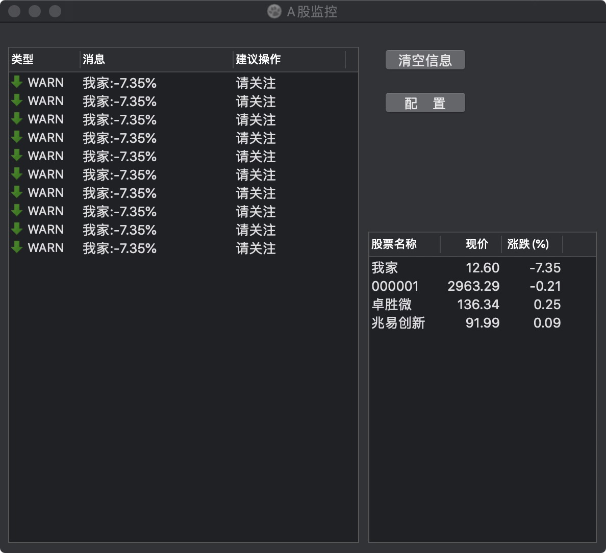
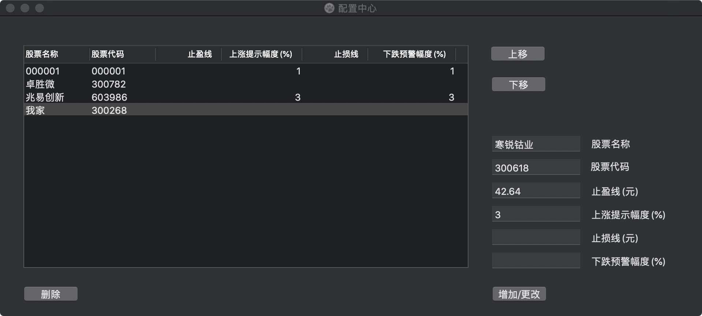
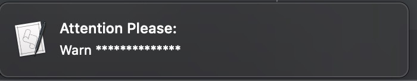

# StockMonitor - A股股票涨跌行情监控助手

自己炒股却是上班族, 总是用手机看盘太频繁老板会不悦? 试试这个小工具 

它每5秒刷新一次行情. 你也可以设置止损线/止盈线, 或者上涨/下跌幅度的提醒线. 如果股票价格或涨跌幅度达到预设的值, windows下任务栏上的小窗回闪烁提醒, mac下会右上角飘窗提醒. 

平时设置好以后就不用管了, 它会自动提醒. 如果你想看行情, 也可以随时点开窗口瞥一眼. 很实用. 是上班族的炒股好帮手.

# 主窗口

# 配置窗口

# mac下的提醒飘窗

